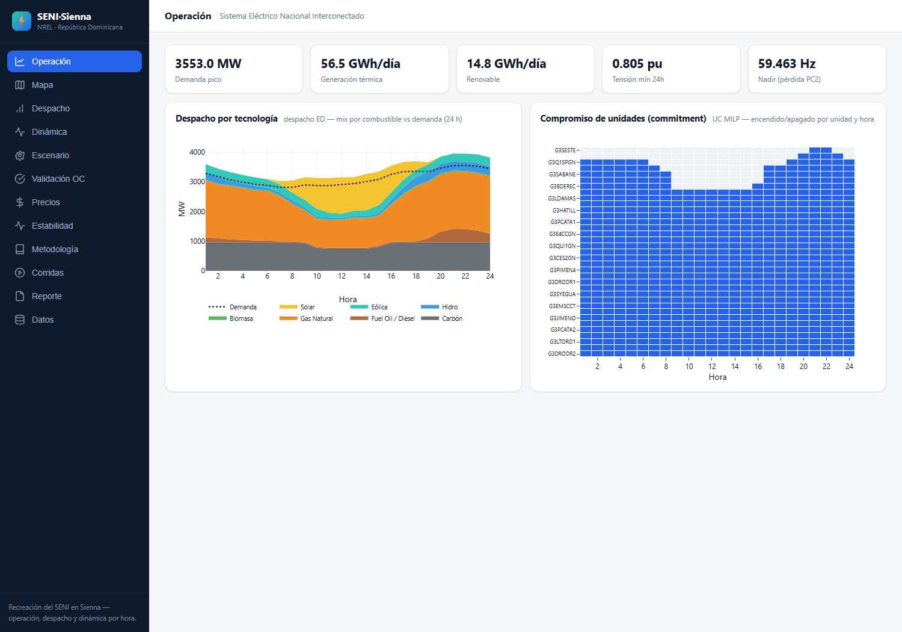
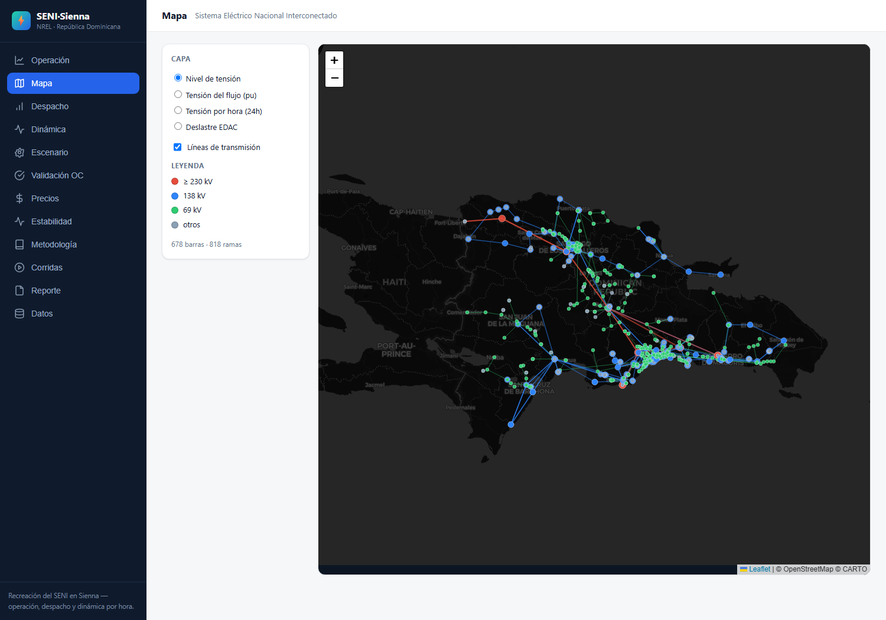
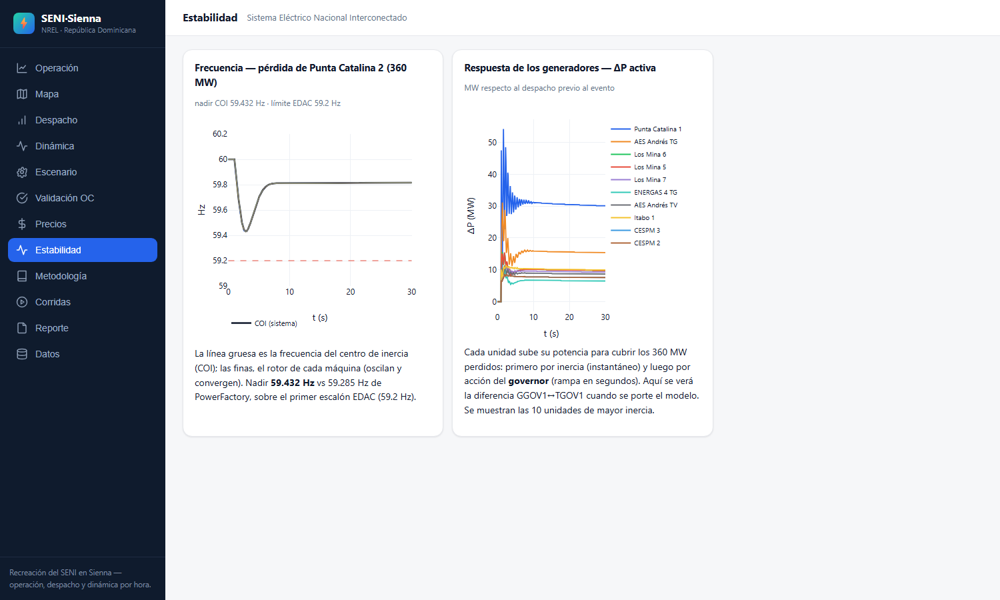
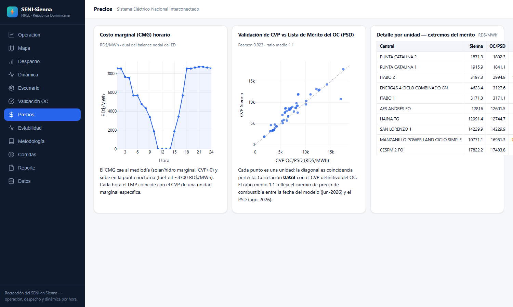
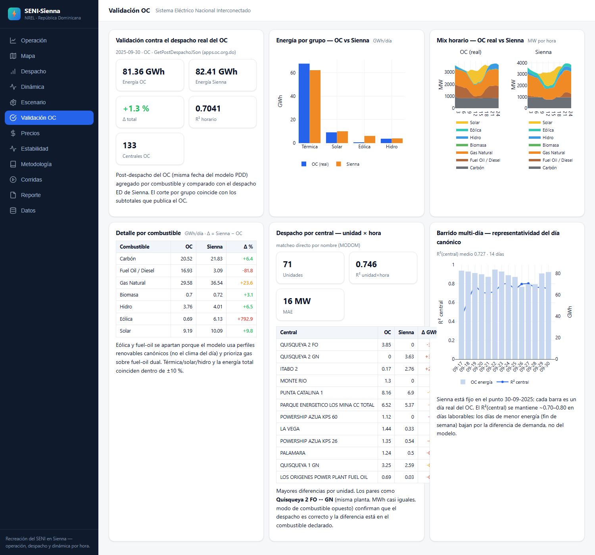
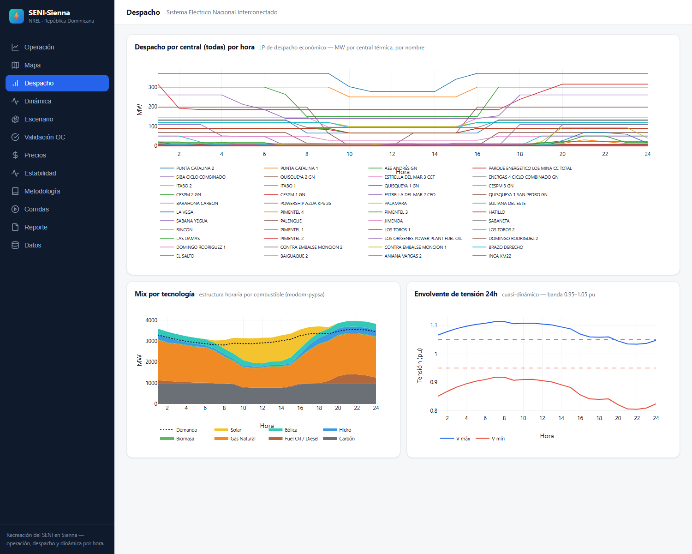

# SENI-Sienna

Recreación del **SENI** (Sistema Eléctrico Nacional Interconectado, República Dominicana) en **[Sienna](https://sienna-platform.github.io/Sienna/)**, la plataforma open-source de modelado de sistemas de potencia de NREL (Julia, BSD-3).

Unifica en una sola plataforma lo que hoy hacen dos proyectos:

- [Feasibility-Study](https://github.com/FCornielle/Feasibility-Study) — estudios de interconexión PV+BESS sobre el modelo PowerFactory del SENI
- [modom-pypsa](https://github.com/FCornielle/modom-pypsa) — réplica del despacho diario del OC (MODOM) en PyPSA + pandapower

📋 **Plan completo**: [PLAN_SENI_SIENNA.md](PLAN_SENI_SIENNA.md) — matriz de cobertura, arquitectura, fases, riesgos y criterios de validación.

## Inicio rápido

```powershell
# 1. Instalar Julia (>= 1.10)
winget install --id=Julialang.Julia

# 2. Instalar dependencias Sienna y verificar el entorno
julia scripts/00_setup_environment.jl

# 3. Copiar los datos confidenciales según data/raw/README.md

# 4. Construir el System del SENI (Fase 1)
julia scripts/01_build_system.jl
```

## Dashboard (plataforma de corridas)

```powershell
.\SENI-Sienna.bat          # → http://localhost:8155
```

SPA React-compatible (Preact + htm, sin build) servida por Oxygen, **12 pestañas**:
- **Operación**: KPIs, mix por combustible horario y heatmap de commitment
- **Mapa**: las 678 barras georreferenciadas sobre Leaflet, con capas de nivel de
  tensión, tensión del flujo AC (pu), tensión por hora y deslastre EDAC
- **Despacho**: despacho por central y comparación vs MODOM
- **Dinámica**: pequeña señal (modos) y respuesta de frecuencia
- **Estabilidad**: trayectorias RMS por generador (frecuencia y ΔP) ante la pérdida de PC2
- **Precios**: costo marginal (CMG) nodal y validación de CVP vs la Lista de Mérito del OC
- **Validación OC**: despacho/mix real del OC (API) vs Sienna, por grupo, combustible y central
- **Escenario** (*Scenario Studio*): perillas de demanda, reserva y unidades fuera
  de servicio → UC alternativo con delta vs la línea base
- **Metodología**: ecuaciones MODOM (KaTeX) ↔ implementación Sienna + criterios
- **Corridas**: lanza cualquier corrida (01–17) con un clic, estado y log en vivo
- **Reporte** · **Datos**: reporte consolidado y procedencia de cada insumo

El frontend (`dashboard/spa/`) usa un stack vendorizado localmente
(Preact/htm/Leaflet/KaTeX en `spa/vendor/`) porque la red bloquea npm; no requiere
`npm install` ni build. Ver `docs/EJECUTABLE.md`.

Para arranque en segundos, compilar una vez la sysimage:

```powershell
julia --project=. scripts/13_build_sysimage.jl   # ~30–60 min, una sola vez
```

Para distribuir sin Julia instalado, un **ejecutable standalone**:

```powershell
julia --project=. scripts/18_build_app.jl        # create_app → build_app/SENI-Sienna.exe
```

## Capturas

**Operación** — KPIs del sistema, mix de despacho por combustible y commitment horario:



**Mapa** — el SENI georreferenciado: 678 barras y 818 ramas por nivel de tensión
(230 kV rojo · 138 kV azul · 69 kV verde) sobre basemap oscuro:



**Estabilidad** — respuesta transitoria ante la pérdida de Punta Catalina 2 (360 MW):
frecuencia del COI (nadir 59.43 Hz, sobre el escalón EDAC de 59.2 Hz) y la potencia
que aporta cada generador (inercia + governor):



**Precios** — costo marginal (CMG) nodal por hora y validación del CVP contra la Lista
de Mérito definitiva del OC (Pearson 0.923):



**Validación OC** — despacho real del OC (API `apps.oc.org.do`) vs Sienna, por grupo,
combustible y central, más la representatividad multi-día:



**Despacho** — despacho por central y comparación vs MODOM:



## Estructura

| Ruta | Contenido |
|---|---|
| `src/` | Módulo `SeniSienna`: traductor PowerFactory/MODOM → PowerSystems.jl, capa dinámica |
| `scripts/00–08` | Un script por fase: setup, build, power flow, despacho ED, UC MILP, N-1, cuasi-dinámico, pequeña señal, transitorios |
| `data/raw/` | Datos confidenciales (no versionados — ver su README) |
| `data/sys/` | System serializado (`to_json`) |
| `validation/` | Comparativas vs PowerFactory / modom-pypsa / MODOM real |
| `test/` | Tests del traductor |

## Estado

- [x] Fase 0 — Esqueleto, plan, entorno Julia + datos en `data/raw/`
- [x] Fase 1 — `System` de despacho MODOM (717 barras, tests 7/7)
- [x] Fase 2 — System físico AC + flujo de carga (|ΔV| medio 0.019 pu; meta 0.005 pendiente del punto de operación P20 exacto — Bloque I)
- [x] Fase 3a — Despacho ED con commitment fijo (**R² 0.957 vs MODOM**, ENS 0)
- [x] Fase 3b — UC MILP con PSI + reservas RPF/RSF co-optimizadas (commitment 89.9% vs MODOM)
- [x] Fase 4 — Contingencias N-1 (659 evaluadas, LODF + AC en críticas) y cuasi-dinámico 24h (24/24 convergen)
- [x] Fase 5 — Dinámica v1 en PSID: pequeña señal (estable; 22 modos ζ<10% vs 26 en PF) y respuesta de frecuencia (nadir 59.463 Hz vs 59.285 PF, pérdida de Punta Catalina 2)
- [x] Fase 6 — Veredictos del Código de Conexión (`src/verdicts.jl`), reporte consolidado con figuras (`validation/REPORTE_SENI_SIENNA.md`) y gaps documentados (cortocircuito/protecciones → flujo híbrido)
- [x] Barrido 1 — Fase 2 cerrada: |ΔV| medio **0.006 pu** con punto P20 exacto + controladores de estación + límites Q (`validation/fase2_flujo_ac.md`)
- [x] Barridos 2–3 — Sobredeslastre EDAC cuantificado (1.39×; escalón 1 completo 3.2×) y costos de arranque (neutro) (`validation/barrido2_3_edac_arranques.md`)
- [x] v2 dinámica — parámetros DSL reales (23 governors + 32 AVR reales; nadir 59.432 vs 59.285 PF) y **estudio de deslastre selectivo**: 30% por alimentador logra mejor recuperación con 3.3× menos carga interrumpida (`validation/v2_dinamica_selectivo.md`, figura f7)
- [ ] **Hito siguiente: ejecutable + dashboard** (estilo modom-pypsa): corridas ED/UC/N-1/QDS/dinámica desde una UI, sysimage precompilada (arranque en segundos), feed OC integrado (`docs/OC_DROPBOX_FEED.md`) y empaquetado distribuible

> ⚠️ Los datos del modelo (exports PowerFactory, tablas MODOM, datos OC) son confidenciales y **no** se versionan en este repositorio.
