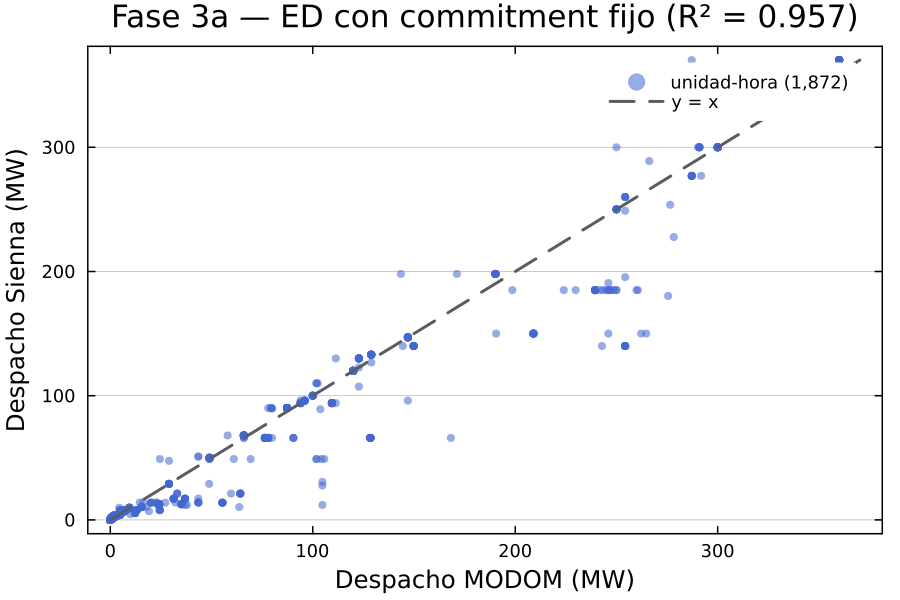
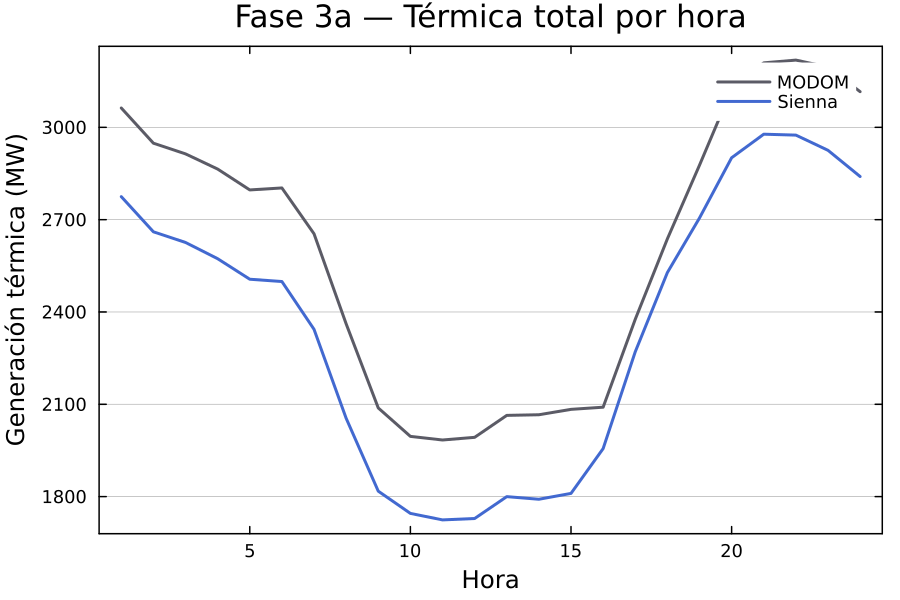
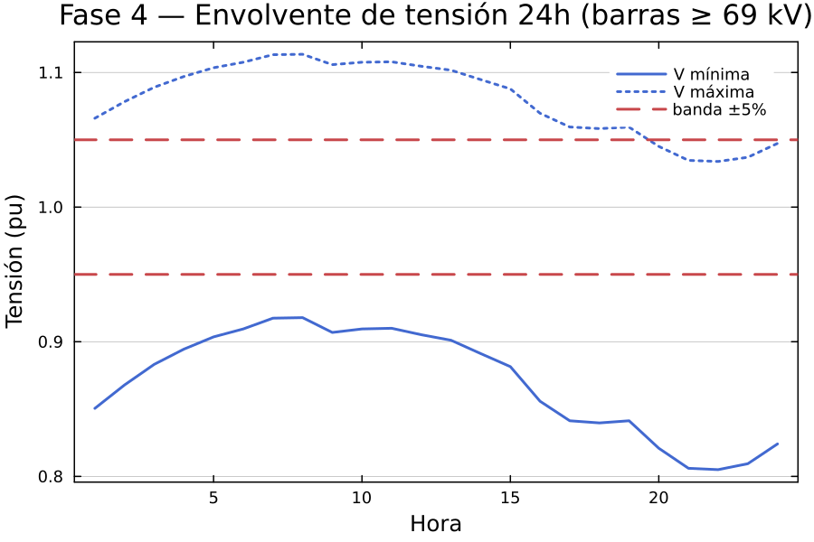
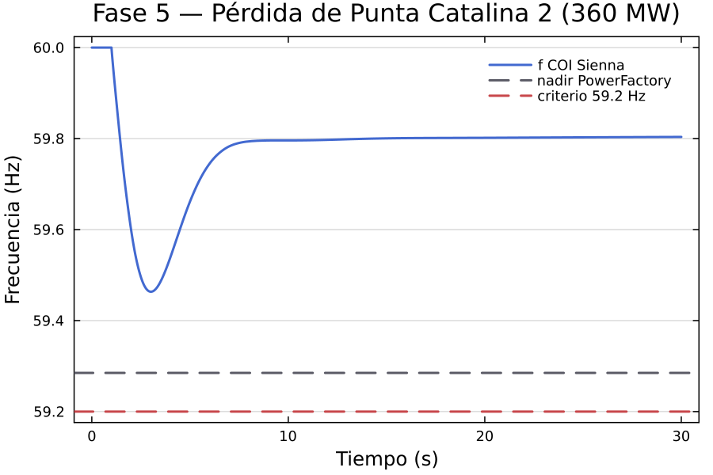
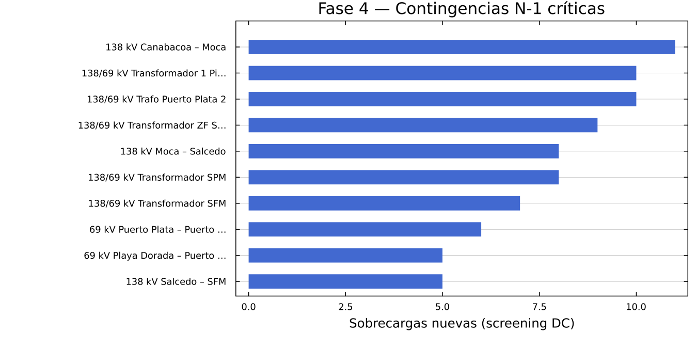

# REPORTE CONSOLIDADO — SENI en Sienna (NREL)

Generado por `scripts/09_report.jl`. Figuras en `validation/figuras/`.

## Resultados por fase

| Fase | Métrica clave | Resultado | Referencia |
|---|---|---|---|
| 2 — Flujo AC | \|ΔV\| medio ≥69 kV | 0.0191 pu | PowerFactory P20 (meta 0.005, pendiente Bloque I) |
| 3a — Despacho ED | R² unidad-hora | **0.9566** | MODOM (meta ≥ 0.94 ✅) |
| 3b — UC MILP | Coincidencia commitment | 89.9 % | MODOM (sin costos de arranque) |
| 3b — Reservas | RPF y RSF co-optimizadas | 3% demanda/h ✅ | Art. 399 / PMP OC 2026-27 |
| 4 — N-1 | Contingencias con sobrecargas nuevas | 49 de 659 | corredor Cibao 138 kV |
| 4 — QDS 24h | Horas convergidas | 24/24 | — |
| 5 — Pequeña señal | Modos EM ζ<10% | 22 | 26 en PowerFactory |
| 5 — Frecuencia | Nadir COI (PC2, 360 MW) | **59.463 Hz** | 59.285 Hz PF |

## Veredictos (Código de Conexión)

- **Frecuencia**: nadir 59.463 Hz →
  CUMPLE el piso de 59.2 Hz (margen 0.263 Hz).
  ¿Activaría EDAC (escalones desde 59.3 Hz)? NO.
- **Amortiguamiento**: ζ mínimo banda EM = 4.89 % —
  línea base del proyecto para veredictos por delta en estudios de interconexión.
- Funciones reutilizables en `src/verdicts.jl`: tensión, sobrecargas,
  amortiguamiento y nadir, todas con lógica de deltas (solo cuenta lo
  introducido o empeorado).

## Nota EDAC (contexto operativo SENI)

Ante la salida de un gran generador (p. ej. Punta Catalina), el SENI opera el
EDAC **abriendo circuitos completos** (alimentadores enteros con toda su carga
mezclada). Es una práctica gruesa: sobredeslastra y no discrimina carga
crítica. Referencias: informe OC "Actualización Esquema EDAC del SENI" (2024,
citado en docs/OC_EDAC_resumen.md) y PMP Jul2026–Jun2027 (análisis de
frecuencia "en proceso de adecuación"; reservas RPF/RSF = 3% de la demanda,
Art. 399). El modelo tiene las **134 etapas EDAC activas** extraídas
(edac_etapas.csv) listas para la v2 dinámica — permitirá cuantificar el
sobredeslastre de la práctica actual vs esquemas selectivos.

## Gaps fuera del alcance de Sienna (flujo híbrido)

- **Cortocircuito IEC 60909**: mantener PowerFactory/pandapower (`calc_sc`).
- **Protecciones/relés**: fuera de alcance.

## Figuras

